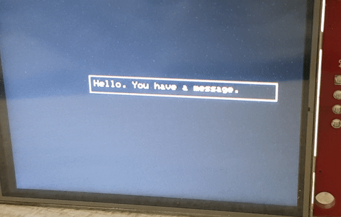

# Adafruit-GFX-Layers
This library is very much in its raw and alpha stage. Best used with a library that supports double buffering or it will be very slow.

# Getting started

You'll need to install the [LinkedList library](https://github.com/ivanseidel/LinkedList).

In your sketch include this library.

`#include <GFXLayer.h>`

Pass your pointer of an instance of the display you're using. This creates a main layer.

`GFXLayerInterface MainLayer(&tft);`

Add to your main loop.

`MainLayer.draw();`

Create more layers.

```
GFXLayerInterface AnotherLayer(&tft);
```
Create elements, supported ones are textElement, rectangleElement, filledRectangleElement and tiled565RGBBitmapElement.

```
textElement notifyTextElement = textElement();
rectangleElement myRectElement = rectangleElement();
filledRectangleElement myFilledRectElement = filledRectangleElement();
tiled565RGBBitmapElement myHeartsElement = tiled565RGBBitmapElement();
```
Add layer to a layer.

` MainLayer.addElement(&AnotherLayer); `

Add element to a layer.

`AnotherLayer.addElement(&notifyTextElement);`

Set visiblity

`notifyTextElement.setVisibility(true);`


# Demo sketch output

(This is running on esp8266)


# Limitations
× True alpha blending not yet supported.

× Memory usage is very inefficient right now.

× Does not support dynamic removal of elements and layers.
